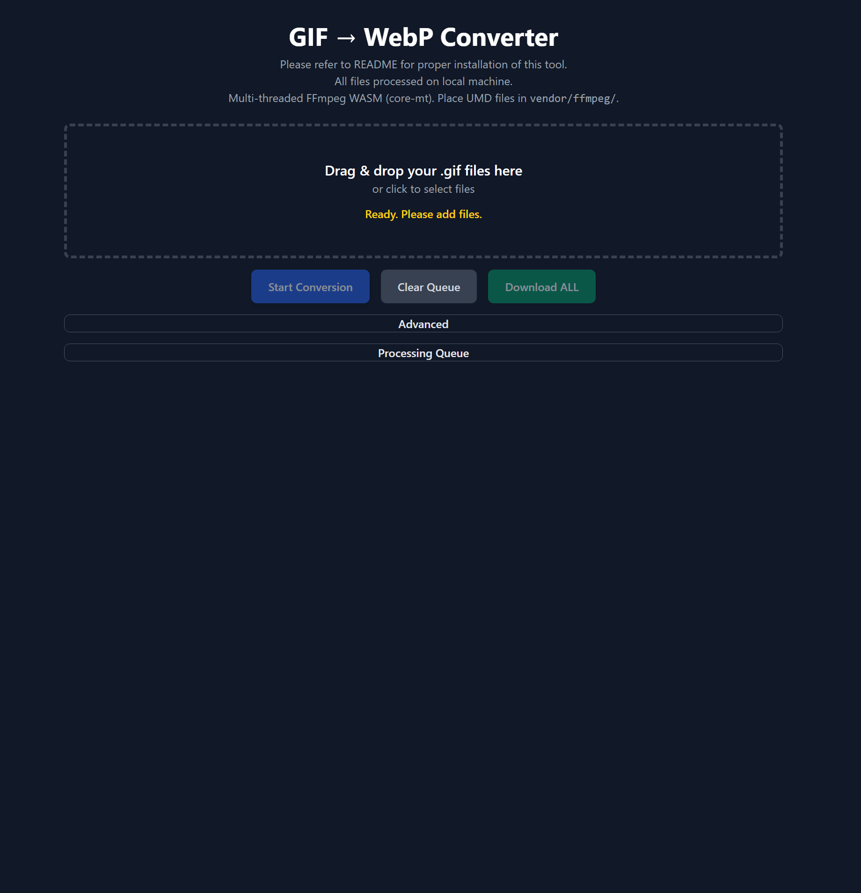
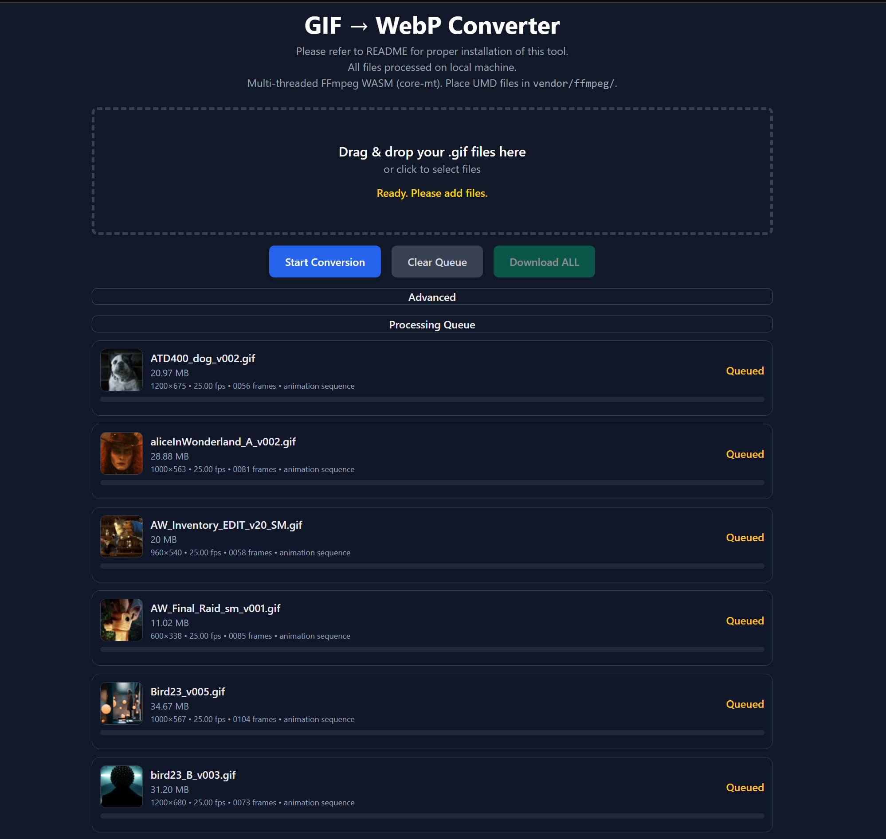
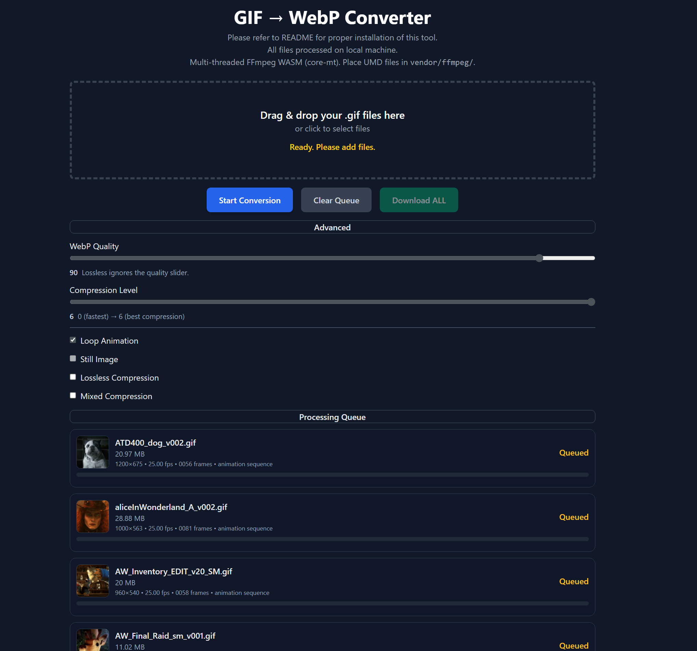
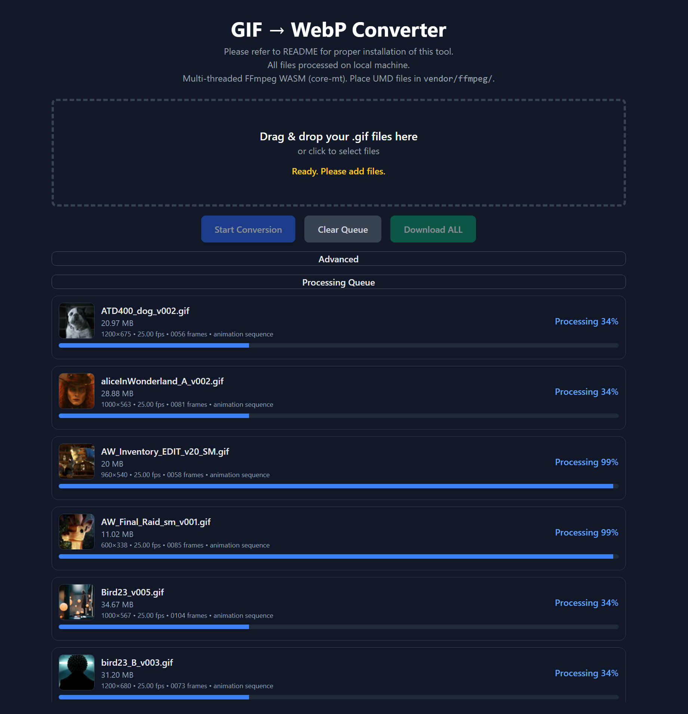
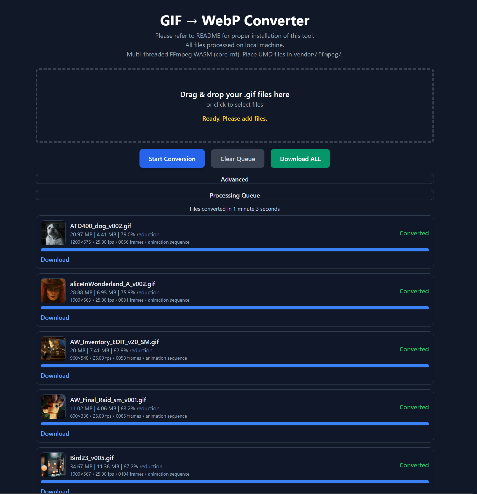
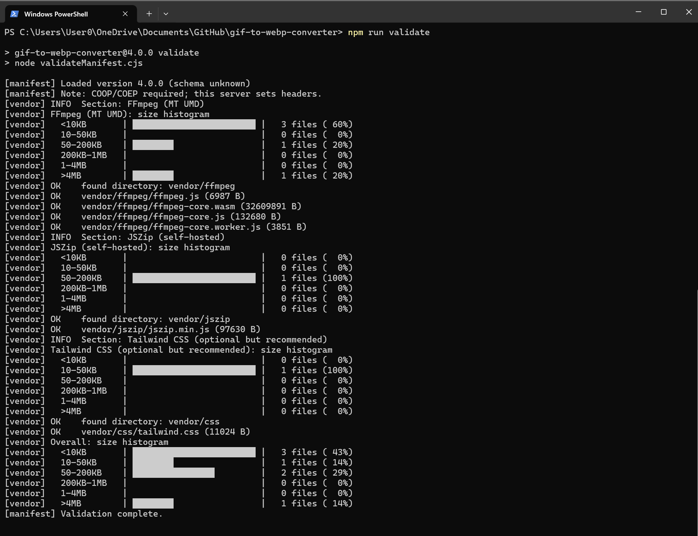

# GIF → WebP Converter --> v4.0 (Multi-Thread, CSP-Compliant)

A self-contained browser-based GIF → WebP converter powered by FFmpeg WASM (multi-threaded).  
All processing is performed locally — no files are uploaded.

---

## 🚀 Usage

## Quick Start (Windows / PowerShell)

1. download repository.
2. Navigate to the root directory of the repository (gif-to-webp-converter)
```
//powershell

cd $HOME\OneDrive\Documents\GitHub\gif-to-webp-converter\
```
3. Run program (strict CSP + COOP/COEP)
```
//powershell

Set-ExecutionPolicy -Scope Process -ExecutionPolicy Bypass
npm run serve
```
4. Open http://localhost:3000 in a browser.

---

## 🆕 Features --> v.0.4.0

- Basic Features
  - Converts Gifs to WebP files (animated files & still images)
  - Batch conversions (multiple files simultaneously)
  - Multithreaded for speed and efficiency
  - Download Converted Files
  - individual WebP files (Download text link on each file Queue)
  - Multiple files as Zip File (Download ALL button)
- Data Points per File
  - file size of original Gif file
  - file size of resulting converted WebP file
  - % reduction / difference between size of WebP vs. original GIF
  - resolution of Gif File
  - FPS of Gif File
  - Frame Duration (# of frames in an animated Gif)
  - indication of animation sequence or still image
- Data Point overall  
  - total time to convert all files in a batch
- Advanced Features
  - WebP Quality (0 - 100)
  - Compression Level (0-6)
  - Loop Animation (loop indefinitely vs. no looping)
  - Still Image (optimizes conversion for still images)
  - Lossless Compression (if not checked then Lossy)
  - Mixed Compression (combined Lossless and Lossy Compression based on content)

---

## 🆕 How it works --> v.0.4.0

1. Open http://localhost:3000 in a browser.


---
2. Drag and Drop Gifs in DROP AREA. (or click on drop area and search for files you want to convert)


---
3. Make changes to how you would like to process/convert your images in the Advanced Section by clicking on the bar titled "Advanced" and expanding to see the options. (NOTE: the defaults work well 90% of the time.)


---
4. Press "Start Conversion" button to begin processing your images/animated gifs.


---
5. When an item is completed in the queue, a "Download" link will appear underneath the thumbnail. When all items in the queue are complete, the "Download All" button will activate. You can download your converted files either way.



---

## 🆕 ChangeLog --> v.0.4.0

- Added `ui-extensions.js` for modular UI improvements:
  - Displays GIF resolution before FPS metadata.
  - Shows file sizes in MB and post-conversion reduction summary (`GIF | WebP | % reduction`).
  - Collapsible “Advanced” (default closed) and “Processing Queue” (default open) sections.
  - Displays aggregate conversion time under “Processing Queue” in format:
    `Files converted in X minute(s) Y seconds`.
- Updated UI styling with lighter blue section headers.
- Updated copy text:
  - “Converter ready…” → “Ready. Please add files.”
  - Added “All files processed on local machine.”
  - Renamed “Download ZIP” → “Download ALL”.
- Removed redundant “Converted in …” line under the drop zone.


---
## 📂 Project Hierarchy

```text
gif-to-webp-converter/
├─ index.html
├─ server.cjs                   # Local Node server with COOP/COEP + CSP headers
├─ package.json
├─ package-lock.json            # Auto-generated by npm (optional in Git)
├─ version.json
├─ README.md
├─ CHANGELOG.md
│
├─ vendor/
│  ├─ css/
│  │  └─ tailwind.css           # Built via `npm run build:css`
│  ├─ ffmpeg/
│  │  ├─ README.txt             # Included so folder exists pre-populated
│  │  ├─ ffmpeg.js              # (you copy in)
│  │  ├─ ffmpeg-core.js         # (you copy in)
│  │  ├─ ffmpeg-core.wasm       # (you copy in)
│  │  ├─ ffmpeg-core.worker.js  # (you copy in)
│  │  ├─ 814.ffmpeg.js          # Loader chunk(s). Count may vary by version.
│  ├─ jszip/
│  │  └─ jszip.min.js           # Self-hosted JSZip (added via npm pack)
│  └─ jszip.mjs                 # ESM wrapper that re-exports window.JSZip
│
├─ src/
│  ├─ app.js                    # Main app logic and event handlers
│  ├─ boot.js                   # FFmpegWASM bootstrap (no inline script)
│  └─ modules/
│     ├─ ffmpegClient.js        # FFmpeg integration
│     ├─ gifInfo.js             # GIF metadata parsing
│     ├─ queueManager.js        # Conversion queue control
│     └─ ui.js                  # Dropzone, banners, and progress UI
│
├─ styles/
│  └─ input.css                 # Tailwind input (source for build)
│
├─ tailwind.config.js           # Tailwind configuration
├─ postcss.config.js            # PostCSS configuration
├─ validateManifest.cjs         # Validates version.json & vendor artifacts
│
├─ node_modules/                # Auto-generated by npm install; not in zips/Git
|   ├─ tailwindcss/
|   ├─ postcss/
|   ├─ autoprefixer/
|   └─ ... (many dependencies)
|   
└─ images/                # Screencaps for README.mdc
   ├─ GIF_WebP_Converter_UI_A_v001.png
   ├─ GIF_WebP_Converter_UI_B_v001.png
   ├─ GIF_WebP_Converter_UI_C_v001.png
   ├─ GIF_WebP_Converter_UI_D_v001.png
   ├─ GIF_WebP_Converter_UI_E_v001.png
   └─ GIF_WebP_Converter_Validation_A_v001.png
```

---

## 🧩 Additional Details

### Tip: FFmpeg load progress
The top banner shows `ffmpeg-core.js`, `ffmpeg-core.wasm`, and `ffmpeg-core.worker.js` with a linear progress bar and a `n/3 complete` counter.

### Troubleshooting
- If FFmpeg fails to load: ensure `vendor/ffmpeg/` contains valid MT UMD chunks.
- If downloads fail: ensure JSZip is accessible from `vendor/jszip/`.
- For performance testing, use Chrome or Edge with multi-thread WebAssembly enabled.

### Self-hosted JSZip (CSP-safe)
This app uses `script-src 'self' 'wasm-unsafe-eval'`. Do **not** import JSZip from a CDN. Use the Quick Start steps above. The ESM wrapper is `/vendor/jszip.mjs` (already included).

### UI Extensions Module

`src/ui-extensions.js` encapsulates browser-side enhancements for the tool:

- **Resolution detection:** Determines GIF dimensions using object URLs.
- **File size management:** Displays GIF and WebP sizes, calculates percent reduction.
- **Collapsible sections:** Toggles the “Advanced” and “Processing Queue” UI.
- **Timing utilities:** Tracks and displays aggregate batch conversion time.

Exposed via `window.UIExt` for internal use in `app.js`.

### CSP Notes

- No inline scripts or `eval()` calls are used.
- All JS modules are imported via `<script type="module">`.
- Compatible with strict Content Security Policies.

---

## "Build From Scratch" (Windows / PowerShell)
**(do at your own risk)**<br>

Although the repository has all of the files needed to run properly using Google Chrome in Windows, if you want are looking to use this application in other browsers or on other OS's , I wanted to share how you can rebuild key components of the relied upon structure in the manner below (only showing windows OS currently). The localization of these elements reflect the desire of the tool to operate within a limited environment. There is a world where the tool could dynamically load or make calls to these services but that is not the intention of this tool. 

```
//powershell

cd $HOME\OneDrive\Documents\GitHub\gif-to-webp-converter\
Set-ExecutionPolicy -Scope Process -ExecutionPolicy Bypass

# Tailwind (self-hosted)
npm i -D tailwindcss@3 postcss autoprefixer
npm run build:css

# FFmpeg Core (engine, MT UMD)
npm init -y
npm pack @ffmpeg/core-mt@0.12.6
tar -xf .\ffmpeg-core-mt-0.12.6.tgz
robocopy .\package\dist\umd .\vendor\ffmpeg *.* /E /NJH /NJS
rmdir /S /Q .\package

# FFmpeg Loader (ffmpeg.js + chunks)
npm pack @ffmpeg/ffmpeg@0.12.10
tar -xf .\ffmpeg-ffmpeg-0.12.10.tgz
robocopy .\package\dist\umd .\vendor\ffmpeg *.* /E /NJH /NJS
rmdir /S /Q .\package

# JSZip (self-hosted)
npm pack jszip@3.10.1
tar -xf .\jszip-3.10.1.tgz
robocopy .\package\dist .\vendor\jszip jszip.min.js /NJH /NJS
rmdir /S /Q .\package

# Validate File Structure
npm run validate

# Run (strict CSP + COOP/COEP)
npm run serve
# open http://localhost:3000
```

---
## Validation (what to expect)

This is a limited diagnostic tool that confirms:
1. the existence of necessary files per the aforementioned "build from scratch"
2. the file size of said files are within range as expected to ensure that errors like downloading HTML files vs. the source js does not accidentally happen.



---
## 🧾 License

MIT License. Use freely for both personal and commercial projects.
