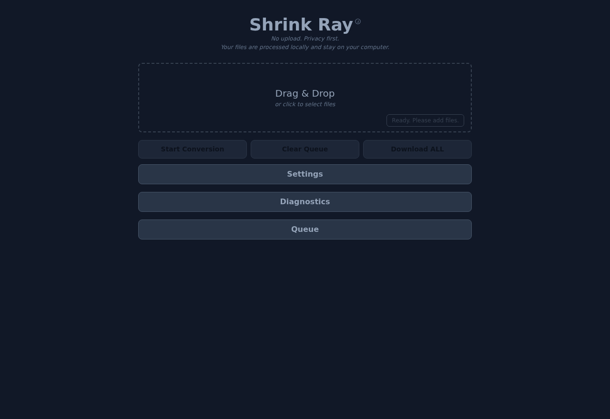
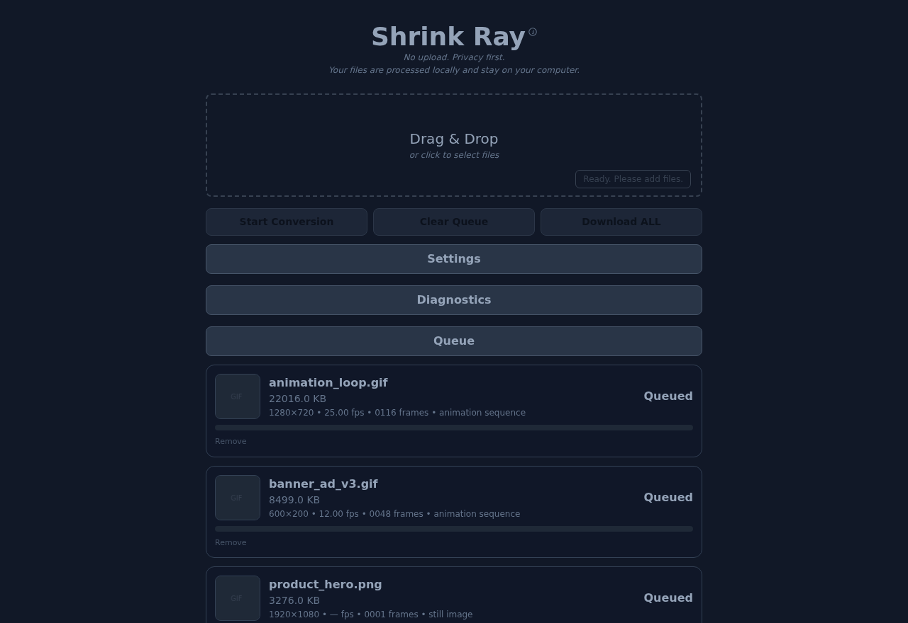
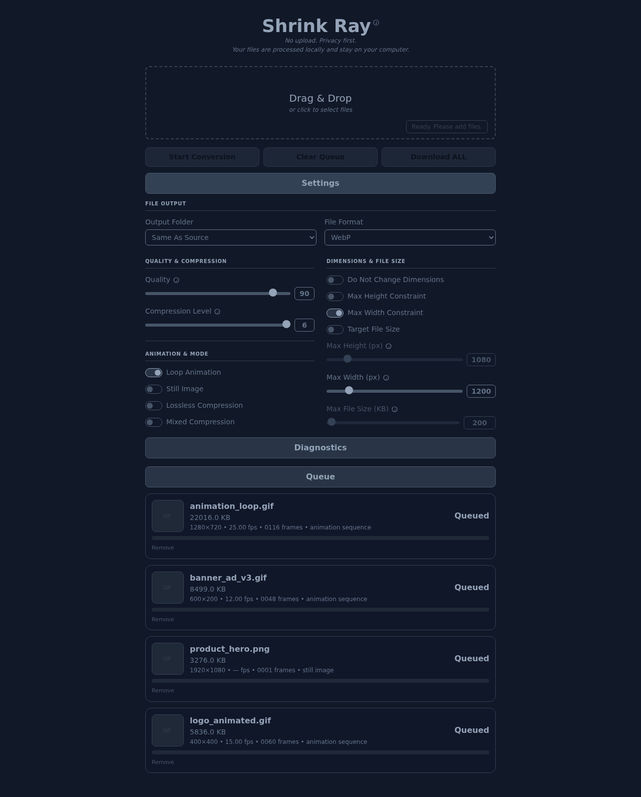
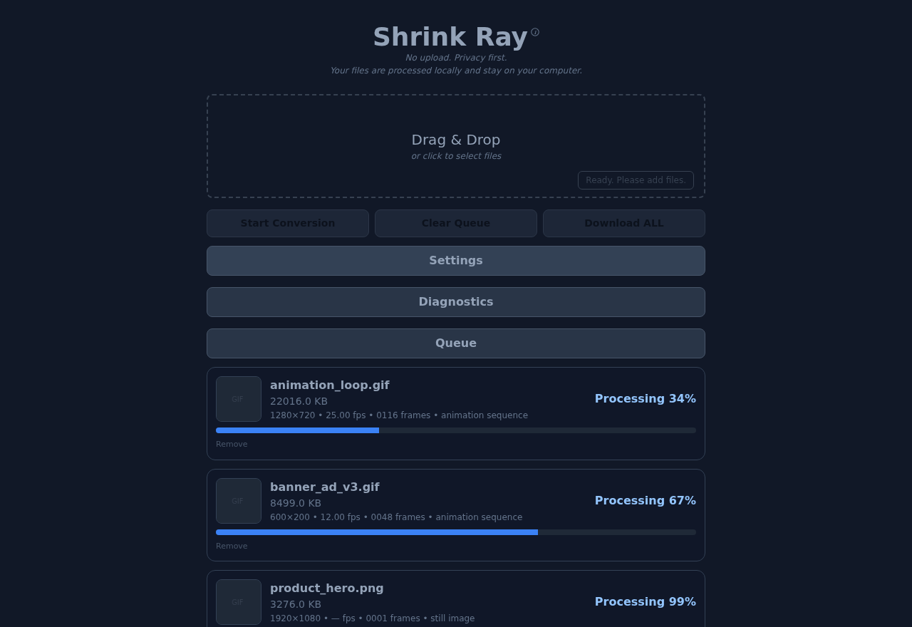
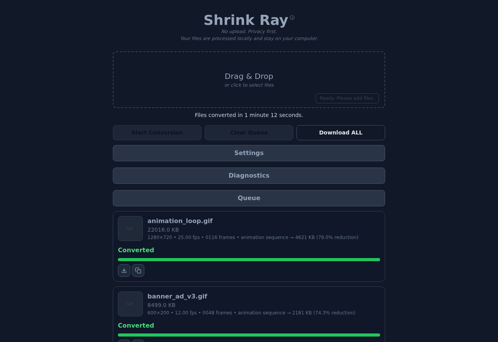

# Shrink Ray --> v4.2 (Multi-Format, Multi-Thread, CSP-Compliant)

A self-contained browser-based image converter powered by FFmpeg WASM (multi-threaded).  
All processing is performed locally — no files are uploaded.

## About This Application

### What is WebP?

WebP is a modern image format developed by Google that supports both lossy and lossless compression, as well as animation. It is designed to create smaller, richer images that make the web faster, offering significantly better compression than either GIF or PNG.

* **For more information:** [https://en.wikipedia.org/wiki/WebP](https://en.wikipedia.org/wiki/WebP)

### What is AVIF?

AVIF is a modern image format based on the AV1 codec. It is often very efficient for still images and is now available as an output option in Shrink Ray.

* **For more information:** [https://en.wikipedia.org/wiki/AVIF](https://en.wikipedia.org/wiki/AVIF)

### What is FFmpeg?

FFmpeg is a powerful, free, and open-source software project capable of handling virtually any multimedia format. This application uses a WebAssembly (WASM) version of FFmpeg, which allows it to run complex video and image processing tasks directly in your browser.

* **For more information:** [https://en.wikipedia.org/wiki/FFmpeg](https://en.wikipedia.org/wiki/FFmpeg)

---

## 🚀 Usage

## Quick Start - Option 01 (Windows / PowerShell)

Use this option when you are running the tool from a Windows-based project folder or from a Windows-use copy of the repository.

1. Download or clone the repository.
2. Navigate to the root directory of the repository (`gif-to-webp-converter`).

```powershell
cd $HOME\OneDrive\Documents\GitHub\gif-to-webp-converter\
```

3. Run the program with strict CSP + COOP/COEP headers.

```powershell
Set-ExecutionPolicy -Scope Process -ExecutionPolicy Bypass
npm run serve
```

4. Open the local app in a browser.

```text
http://localhost:3000
```

---

## Quick Start - Option 02 (WSL Development + Windows Everyday Launcher)

Use this option only when you are actively developing the tool in WSL/Ubuntu and also want to launch it from Windows as an everyday tool.

This workflow keeps one source of truth for development:

```text
WSL / Ubuntu development repo:
/home/rmcdougal/projects/gif-to-webp-converter

Windows launcher location:
C:\Users\ryanm\tools\launchers\gif-to-webp-converter.bat
```

The Windows `.bat` file is only a launcher. It does not duplicate the source repo. It calls a small WSL runner script, which loads `nvm`, switches into the project folder, and runs `npm run serve`.

### 1. Confirm the WSL project runs with the correct Node/npm

From WSL/Ubuntu:

```bash
cd ~/projects/gif-to-webp-converter
which node
which npm
node -v
npm -v
```

Expected result should point to the WSL `nvm` install, similar to:

```text
/home/rmcdougal/.nvm/versions/node/v24.13.0/bin/node
/home/rmcdougal/.nvm/versions/node/v24.13.0/bin/npm
v24.13.0
11.6.2
```

### 2. Create the WSL runner script

From WSL/Ubuntu:

```bash
mkdir -p ~/bin

cat > ~/bin/run-gif-to-webp-converter <<'EOF'
#!/usr/bin/env bash

export NVM_DIR="$HOME/.nvm"

if [ -s "$NVM_DIR/nvm.sh" ]; then
  . "$NVM_DIR/nvm.sh"
else
  echo "ERROR: nvm not found at $NVM_DIR/nvm.sh"
  exit 1
fi

cd "$HOME/projects/gif-to-webp-converter" || exit 1

echo "Using node: $(which node)"
echo "Using npm:  $(which npm)"
echo "Node version: $(node -v)"
echo "npm version:  $(npm -v)"
echo

npm run serve
EOF

chmod +x ~/bin/run-gif-to-webp-converter
```

### 3. Test the WSL runner directly

From WSL/Ubuntu:

```bash
~/bin/run-gif-to-webp-converter
```

The server should start and print the local URL. Open the app in Windows at:

```text
http://localhost:3000
```

Stop the server with:

```text
Ctrl+C
```

### 4. Create the Windows launcher folder

From WSL/Ubuntu:

```bash
mkdir -p /mnt/c/Users/ryanm/tools/launchers
```

### 5. Create the Windows `.bat` launcher

From WSL/Ubuntu:

```bash
WINTOOLS="/mnt/c/Users/ryanm/tools"

cat > "$WINTOOLS/launchers/gif-to-webp-converter.bat" <<'EOF'
@echo off
wsl.exe -d Ubuntu-22.04 -- bash --noprofile --norc /home/rmcdougal/bin/run-gif-to-webp-converter
pause
EOF
```

### 6. Launch from Windows

From Windows PowerShell:

```powershell
C:\Users\ryanm\tools\launchers\gif-to-webp-converter.bat
```

Then open:

```text
http://localhost:3000
```

### Why this option exists

This avoids maintaining two active copies of the same repo. The recommended model is:

```text
WSL / Ubuntu repo = development source of truth
Windows tools folder = launcher and everyday access point
GitHub = remote backup and version history
```

If the launcher fails by using Windows Node/npm instead of WSL Node/npm, confirm that the runner script prints WSL `nvm` paths for both `node` and `npm`.

---

## 🆕 Features --> v4.2

- Basic Features
  - Converts GIF, PNG, and JPG/JPEG files to WebP or AVIF.
  - Batch conversions (multiple files simultaneously)
  - Multithreaded for speed and efficiency
  - Automatic per-file download immediately after conversion completes.
  - Individual converted files remain available through the "Download" link on each Queue item.
  - Multiple files as Zip File (Download ALL button)
  - Add/Remove files in the Queue
  - Clear Queue is enabled only when queued items exist.
- Data Points per File
  - file size of original file
  - file size of resulting converted file
  - % reduction / difference between converted file vs. original file
  - resolution of source file
  - FPS of GIF file
  - Frame Duration (# of frames in an animated GIF)
  - indication of animation sequence or still image
- Data Point overall  
  - total time to convert all files in a batch
- Settings
  - Output Folder dropdown: Same As Source or Select Folder.
  - Select Folder uses the browser File System Access API where supported; otherwise the browser's normal download behavior is used.
  - File Format dropdown: WebP or AVIF.
  - WebP uses the existing stable FFmpeg core in `vendor/ffmpeg/`.
  - AVIF uses an isolated AVIF-only WASM engine in `vendor/jsquash-avif/`; WebP remains on the existing FFmpeg core.
  - Quality (0 - 100), mapped to WebP qscale or AVIF CRF as appropriate.
  - Compression Level (0-6)
  - Target File Size for WebP and AVIF using quality binary search.
  - Resize Down (Proportional): set max width and/or max height in px; image is proportionally reduced only when source exceeds constraints (no upsizing)
  - Do Not Change Dimensions
  - Loop Animation (WebP only; disabled for AVIF)
  - Still Image (optimizes conversion for still images)
  - Lossless Compression (WebP only; disabled for AVIF)
  - Mixed Compression (WebP only; disabled for AVIF)
- UI and Usability
  - Renamed app UI to "Shrink Ray".
  - Renamed "Advanced" to "Settings" and "Processing Queue" to "Queue".
  - Editable numeric value fields next to sliders; typed values update sliders dynamically.
  - Slider number inputs hide native up/down spinner buttons for a cleaner UI.
  - Diagnostics uses a switch/toggle instead of a checkbox.
  - Diagnostics, Queue, Settings, and action button colors were refined for a quieter slate UI.
  - Queue progress, file names, and status use the Shrink Ray header color.
  - Dropzone and header helper popups were simplified and restyled.

---

## 🆕 How it works --> v4.2

**1. Open the app in a browser at [http://localhost:3000](http://localhost:3000).**

The Shrink Ray interface loads with a Drag & Drop zone and collapsed Settings, Diagnostics, and Queue panels ready to use.



---

**2. Drop your files onto the drop zone (or click to browse).**

Drag GIF, PNG, or JPG/JPEG files directly onto the drop zone. Each file is added to the Queue as a card showing its filename, file size, resolution, frame count, FPS, and whether it is an animation or still image. A **Remove** link lets you pull individual files before conversion starts.



---

**3. (Optional) Expand Settings to adjust conversion options.**

Click the **Settings** bar to reveal all conversion controls: output folder, output format (WebP or AVIF), quality, compression level, animation/still-image mode, lossless compression, dimension constraints, and target file size. The defaults work well in most cases — this step is only needed when you want to fine-tune the output.



---

**4. Click "Start Conversion" to begin processing.**

All files in the Queue are converted in parallel. Each card shows a live progress bar and percentage while its file is being processed.



---

**5. Download your converted files.**

When each file finishes, its card updates to **Converted** (in green), shows the output file size and percent reduction, and displays a download icon to save that file. Once all files are done, a batch timing message appears and the **Download ALL** button activates so you can grab every converted file as a single zip.



---

## 🆕 ChangeLog --> v4.2

**Changes Since the February 16 Update**  
- Rebranded the browser UI from "Image → WebP Converter" / "PicPress" to **Shrink Ray**.
- Added a privacy subhead: "No upload. Privacy first. Your files are processed locally and stay on your computer."
- Added **AVIF output** alongside WebP.
- Added a **File Output** area in Settings:
  - Output Folder dropdown with Same As Source and Select Folder.
  - Folder picker field and Browse button shown only when Select Folder is chosen.
  - File Format dropdown with WebP and AVIF.
- Added **Target File Size** quality search for both WebP and AVIF conversions.
- Renamed **WebP Quality** to **Quality** and mapped it to:
  - WebP `-qscale`
  - AVIF `-crf`
- Disabled WebP-only controls automatically when AVIF is selected:
  - Lossless Compression
  - Mixed Compression
  - Loop Animation
- Added editable numeric slider value fields for:
  - Quality
  - Compression Level
  - Max Height
  - Max Width
  - Max File Size
- Removed native number-input spinner buttons from those value fields.
- Added Max Height Constraint and Do Not Change Dimensions controls.
- Renamed **Advanced** to **Settings**.
- Renamed **Processing Queue** to **Queue**.
- Added automatic Clear Queue enable/disable behavior based on queue contents.
- Refined Queue styling:
  - file names, status text, and progress bar use the Shrink Ray header color
  - metadata under file names uses the privacy subhead color
  - Download and Remove links are smaller
- Replaced the Diagnostics checkbox with a palette-matched switch/toggle.
- Restyled Diagnostics Clear and Copy buttons to match primary action-button styling.
- Refined header, dropzone, Settings, Queue, and tooltip colors.
- Simplified helper popups:
  - Shrink Ray popup now references README, local processing, and supported input formats
  - dropzone popup now says "gif, png or jpg"
- Reduced the header and dropzone info icons for a cleaner visual hierarchy.
- Added selected-folder saving through the browser File System Access API when supported.

**Browser Security Note**  
- A web page cannot silently discover or write to the original source file's folder from a standard file input or drag/drop. "Same As Source" remains the default UI intent, but actual custom-folder writing requires the user to choose **Select Folder** and grant browser permission.

**Feature Enhancements**  
- Added ability to **remove individual files** from the processing queue before conversion:  
  - Each queued item now includes a **“Remove”** link.  
  - Clicking “Remove” instantly hides the item from the UI and excludes it from processing.  
  - All “Remove” links automatically hide when conversion begins.  
- **Per-file download improvements:**  
  - Each converted download filename now appends a timestamp in `_MMDDYYYY_HHMM` format (e.g. `clip_v001_11112025_0655.webp`).  
- **Batch download improvements:**  
  - “Download ALL” zip files now include a timestamped suffix in the same format  
    (e.g. `converted_webp_files_11112025_064025.zip`).  
- **Header and layout refinements:**  
  - “Settings” and “Queue” headers are now centered.  
  - Clear Queue also clears any displayed “Files converted in …” aggregate timing message.  
- Internal updates to `ui-extensions.js` and `app.js` to support placement consistency between “Remove” and “Download”, and improve dynamic filename updates.


---
## 📂 Project Hierarchy

```text
gif-to-webp-converter/
├─ index.html
├─ server.cjs                   # Local Node server with COOP/COEP + CSP headers
├─ package.json
├─ package-lock.json            # Auto-generated by npm (optional in Git)
├─ version.json
├─ README.md
├─ CHANGELOG.md
│
├─ vendor/
│  ├─ css/
│  │  └─ tailwind.css           # Built via `npm run build:css`
│  ├─ ffmpeg/
│  │  ├─ README.txt             # Included so folder exists pre-populated
│  │  ├─ ffmpeg.js              # (you copy in)
│  │  ├─ ffmpeg-core.js         # (you copy in)
│  │  ├─ ffmpeg-core.wasm       # (you copy in)
│  │  ├─ ffmpeg-core.worker.js  # (you copy in)
│  │  ├─ 814.ffmpeg.js          # Loader chunk(s). Count may vary by version.
│  ├─ jszip/
│  │  └─ jszip.min.js           # Self-hosted JSZip (added via npm pack)
│  └─ jszip.mjs                 # ESM wrapper that re-exports window.JSZip
│
├─ src/
│  ├─ app.js                    # Main app logic and event handlers
│  ├─ boot.js                   # FFmpegWASM bootstrap (no inline script)
│  └─ modules/
│     ├─ ffmpegClient.js        # FFmpeg integration
│     ├─ gifInfo.js             # GIF metadata parsing
│     ├─ queueManager.js        # Conversion queue control
│     └─ ui.js                  # Dropzone, banners, and progress UI
│
├─ styles/
│  └─ input.css                 # Tailwind input (source for build)
│
├─ tailwind.config.js           # Tailwind configuration
├─ postcss.config.js            # PostCSS configuration
├─ validateManifest.cjs         # Validates version.json & vendor artifacts
│
├─ node_modules/                # Auto-generated by npm install; not in zips/Git
|   ├─ tailwindcss/
|   ├─ postcss/
|   ├─ autoprefixer/
|   └─ ... (many dependencies)
|   
└─ images/                # Screencaps for README.mdc
   ├─ GIF_WebP_Converter_UI_A_v001.png
   ├─ GIF_WebP_Converter_UI_B_v001.png
   ├─ GIF_WebP_Converter_UI_C_v001.png
   ├─ GIF_WebP_Converter_UI_D_v001.png
   ├─ GIF_WebP_Converter_UI_E_v001.png
   └─ GIF_WebP_Converter_Validation_A_v001.png
```

---
## Project Structure

Here is a breakdown of what each file and folder does in this application.

### Core Application Files (`src/`)

This directory contains all the JavaScript code that makes your application work.

* `src/app.js`: This is the **main controller** of the entire application. It's responsible for:
    * Loading FFmpeg.
    * Setting up all the main event listeners (drag-and-drop, file input, Start, Clear, Download All).
    * Initializing the conversion queue from `queueManager.js`.
    * Grabbing the user's settings (like output format, quality, output folder, loop, etc.) from the UI.
    * Telling the queue to start when the "Start Conversion" button is clicked.
* `src/boot.js`: This is a tiny helper script. Its only job is to load the main `app.js` file as a "module" (`<script type="module">`). This is required to use modern `import` and `export` features.

### Core Logic Modules (`src/modules/`)

These files break the application's logic into clean, reusable pieces.

* `src/modules/ffmpegClient.js`: This is the **WebP conversion engine**. It talks to the stable FFmpeg WebAssembly core in `/vendor/ffmpeg/`.
    * `initFFmpeg`: Loads the WebP FFmpeg WebAssembly core.
    * `convertToWebP`: Takes a source image and your settings, runs the WebP `ffmpeg` command, and reports progress.
* `src/modules/avifClient.js`: This is the **AVIF conversion engine**. It uses the isolated `@jsquash/avif` WASM encoder vendored in `/vendor/jsquash-avif/`.
    * `hasAvifEngineFiles`: Checks whether the AVIF WASM engine files are present before enabling AVIF in the File Format dropdown.
    * `convertToAvif`: Converts still images, and the first frame of animated inputs, to AVIF. Target File Size uses the same quality binary-search pattern as WebP.
    * AVIF encoding runs in `src/modules/avifWorker.js` so slower AVIF compression does not block the browser UI thread.
* `src/modules/ui.js`: This file is responsible for **all changes to the web page**. It doesn't know *how* to convert a file, but it knows how to *show* the process.
    * It creates the file items in the queue when you drop them.
    * It updates the progress bar (`updateItemProgress`).
    * It changes the status from "Queued" to "Processing" to "Converted".
    * It creates the "Download" link for a finished file (`setItemConverted`).
    * It shows error messages (`setItemError`).
    * It controls the pop-up banner that appears while FFmpeg is first loading.
* `src/modules/queueManager.js`: This file manages the **list of files** to be converted.
    * It lets you add files to the queue.
    * Its `run` function starts all the conversion tasks in parallel.
    * Its `clear` function removes all files from the UI.
* `src/modules/gifInfo.js`: This is a utility that **reads GIF metadata**. It quickly reads the file to get information like frame count and framerate (FPS) *without* needing to use the heavy FFmpeg library. This is why you see that info instantly when you add a file.
* `src/ui-extensions.js`: This module handles collapsible sections, diagnostics interactions, info popups, file-size summaries, remove links, download filename updates, and batch timing.
* `src/modules/perFrameMixer.js`: Experimental/auxiliary logic retained in the repo but not part of the main conversion path.

### Server & Configuration

* `server.cjs`: This is your **local web server** (run via `npm run serve`). Its job is to:
    1.  Serve your `index.html` file.
    2.  Serve all your other assets (JavaScript, CSS, and the FFmpeg files).
    3.  Set the special `Cross-Origin-Opener-Policy` and `Cross-Origin-Embedder-Policy` security headers. These are **required** by browsers to enable `SharedArrayBuffer`, which FFmpeg.js needs for performance.
* `package.json`: This is the project's **manifest**. It lists your project's dependencies (like Tailwind CSS) and defines your `npm` scripts (`serve`, `build:css`).
* `index.html`: The **single HTML page** for the entire application. It contains the HTML structure for the dropzone, buttons, Settings panel, Diagnostics panel, Queue, and results list.

### Styling & Vendor Files

* `styles/input.css`: This is your **source CSS file**. You write your Tailwind directives here (like `@tailwind base;`).
* `vendor/css/tailwind.css`: This is the **output CSS file** that is actually loaded by `index.html`. It is the generated result of running `npm run build:css`.
* `tailwind.config.js`: The **configuration file for Tailwind CSS**.
* `postcss.config.js`: The configuration file for PostCSS, the tool that runs Tailwind.
* `vendor/ffmpeg/`: This folder contains the **stable WebP FFmpeg.js core** and shared FFmpeg UMD loader used by the app.
* `vendor/jsquash-avif/`: This folder contains the isolated **AVIF WASM encoder** from `@jsquash/avif`.
* `vendor/jszip/`: This folder contains the **JSZip library**, which is used by the "Download All" button to create a `.zip` file in your browser.

---
## 🧩 Additional Details

### Tip: FFmpeg load progress
The top banner shows `ffmpeg-core.js`, `ffmpeg-core.wasm`, and `ffmpeg-core.worker.js` with a linear progress bar and a `n/3 complete` counter.

### Troubleshooting
- If WebP FFmpeg fails to load: ensure `vendor/ffmpeg/` contains valid MT UMD chunks.
- If AVIF is unavailable: ensure `vendor/jsquash-avif/codec/enc/avif_enc.js` and `vendor/jsquash-avif/codec/enc/avif_enc.wasm` are present.
- If downloads fail: ensure JSZip is accessible from `vendor/jszip/`.
- For performance testing, use Chrome or Edge with multi-thread WebAssembly enabled.

### Self-hosted JSZip (CSP-safe)
This app uses `script-src 'self' 'wasm-unsafe-eval'`. Do **not** import JSZip from a CDN. Use the Quick Start steps above. The ESM wrapper is `/vendor/jszip.mjs` (already included).

### UI Extensions Module

`src/ui-extensions.js` encapsulates browser-side enhancements for the tool:

- **Resolution detection:** Determines GIF dimensions using object URLs.
- **File size management:** Displays GIF and WebP sizes, calculates percent reduction.
- **Collapsible sections:** Toggles the “Settings”, “Diagnostics”, and “Queue” UI.
- **Timing utilities:** Tracks and displays aggregate batch conversion time.

Exposed via `window.UIExt` for internal use in `app.js`.

### CSP Notes

- No inline scripts or `eval()` calls are used.
- All JS modules are imported via `<script type="module">`.
- Compatible with strict Content Security Policies.

---

## "Build From Scratch" (Windows / PowerShell)
**(do at your own risk)**<br>

Although the repository has all of the files needed to run properly using Google Chrome in Windows, if you want are looking to use this application in other browsers or on other OS's , I wanted to share how you can rebuild key components of the relied upon structure in the manner below (only showing windows OS currently). The localization of these elements reflect the desire of the tool to operate within a limited environment. There is a world where the tool could dynamically load or make calls to these services but that is not the intention of this tool. 

```
//powershell

cd $HOME\OneDrive\Documents\GitHub\gif-to-webp-converter\
Set-ExecutionPolicy -Scope Process -ExecutionPolicy Bypass

# Tailwind (self-hosted)
npm i -D tailwindcss@3 postcss autoprefixer
npm run build:css

# FFmpeg Core (engine, MT UMD)
npm init -y
npm pack @ffmpeg/core-mt@0.12.6
tar -xf .\ffmpeg-core-mt-0.12.6.tgz
robocopy .\package\dist\umd .\vendor\ffmpeg *.* /E /NJH /NJS
rmdir /S /Q .\package

# FFmpeg Loader (ffmpeg.js + chunks)
npm pack @ffmpeg/ffmpeg@0.12.10
tar -xf .\ffmpeg-ffmpeg-0.12.10.tgz
robocopy .\package\dist\umd .\vendor\ffmpeg *.* /E /NJH /NJS
rmdir /S /Q .\package

# JSZip (self-hosted)
npm pack jszip@3.10.1
tar -xf .\jszip-3.10.1.tgz
robocopy .\package\dist .\vendor\jszip jszip.min.js /NJH /NJS
rmdir /S /Q .\package

# Validate File Structure
npm run validate

# Run (strict CSP + COOP/COEP)
npm run serve
# open http://localhost:3000
```

---
## Validation (what to expect)

This is a limited diagnostic tool that confirms:
1. the existence of necessary files per the aforementioned "build from scratch"
2. the file size of said files are within range as expected to ensure that errors like downloading HTML files vs. the source js does not accidentally happen.


---
## 🧾 License

MIT License. Use freely for both personal and commercial projects.
