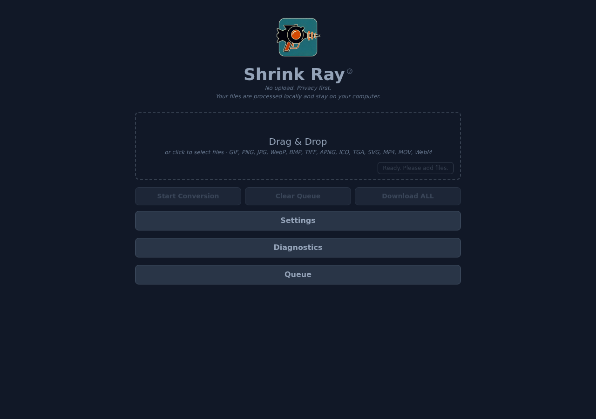
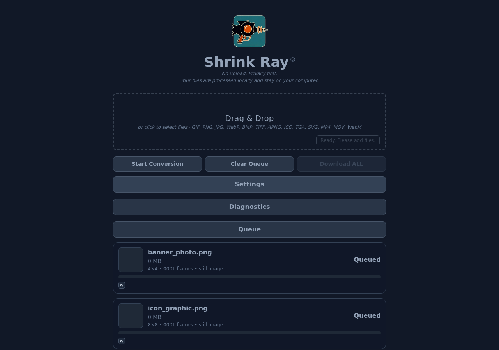
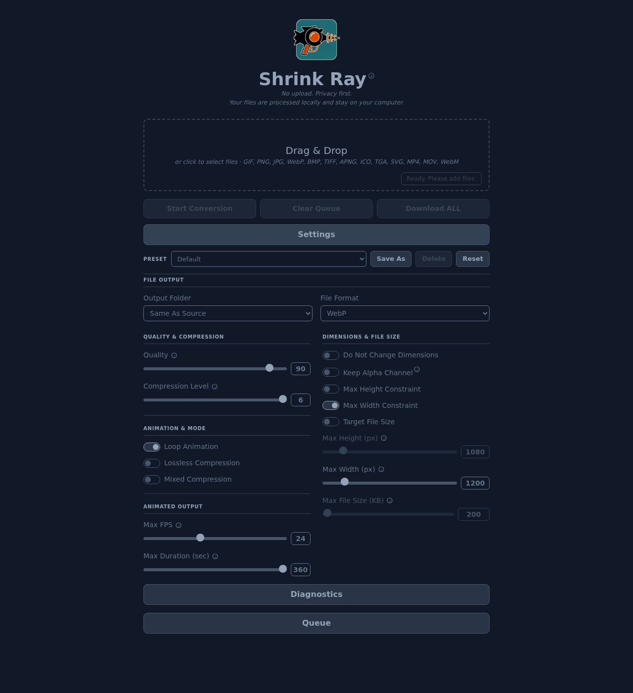
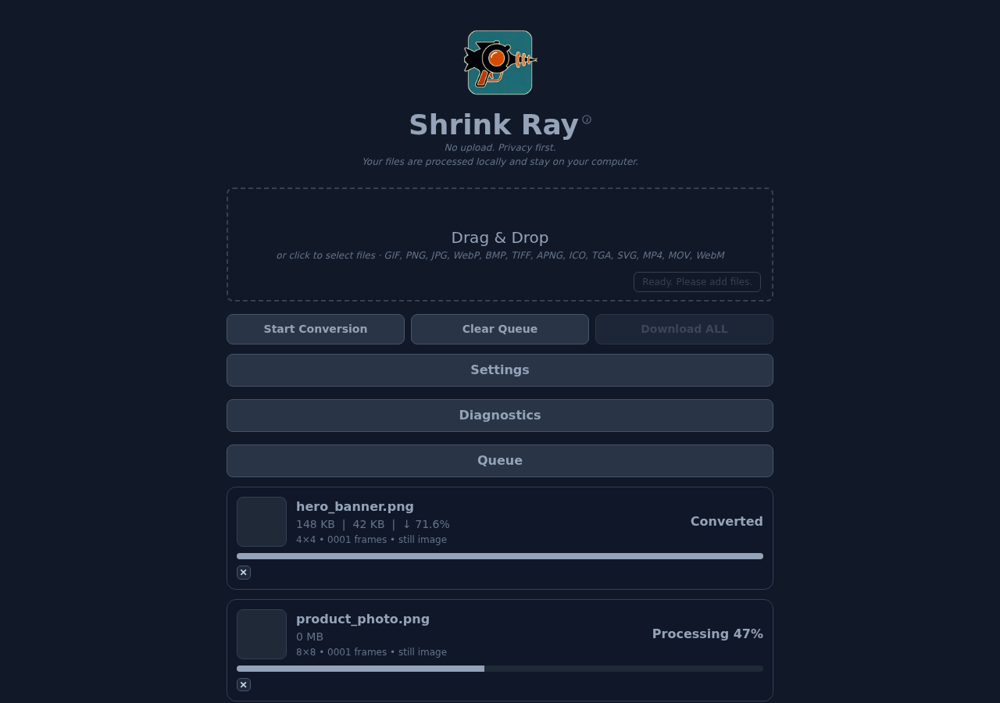
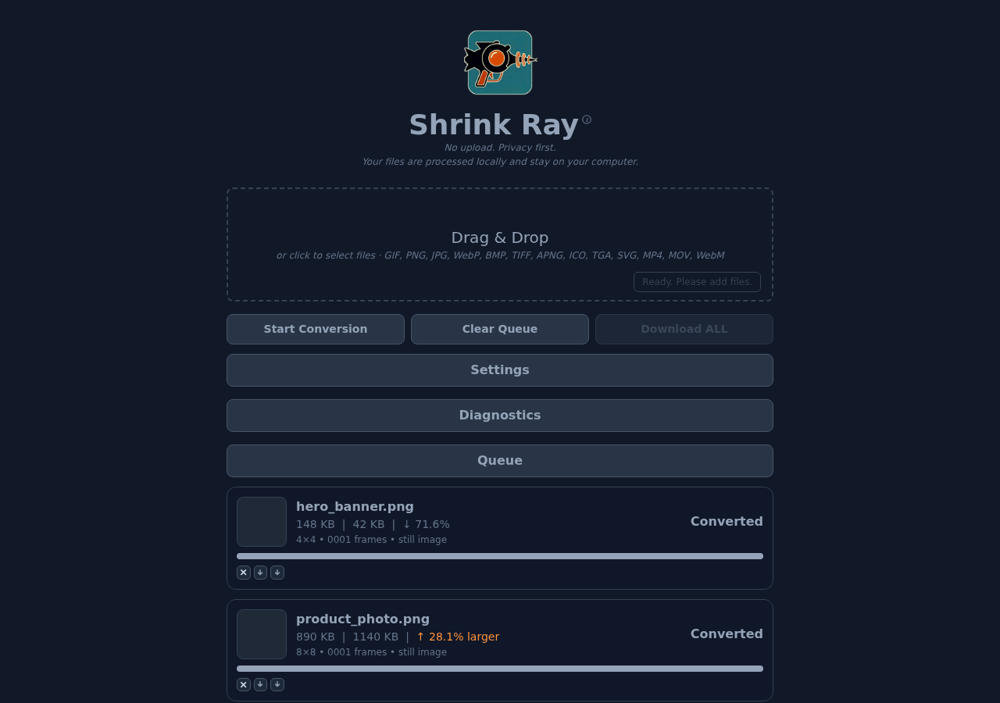
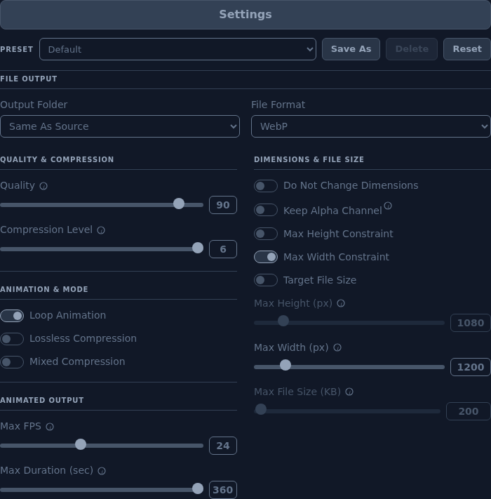

# Shrink Ray --> v5.1 (Presets, Expanded Formats, Multi-Thread)

A self-contained browser-based image and video converter powered by FFmpeg WASM (multi-threaded).  
All processing is performed locally — no files are uploaded.

---

## Contents

- [About This Application](#about)
  - [What is WebP?](#what-is-webp)
  - [What is AVIF?](#what-is-avif)
  - [What is FFmpeg?](#what-is-ffmpeg)
- [Usage](#usage)
  - [Quick Start (Windows / PowerShell)](#quick-start-option-01)
- [Features v5.1](#features)
- [How It Works v5.1](#how-it-works)
- [ChangeLog v5.1](#changelog)
- [License](#license)

---

## About This Application

Shrink Ray is a tool for compressing still images and video files into modern, web-optimized formats so they load faster and display more efficiently online. It runs entirely in your browser — no files are uploaded to any server.

### What is WebP?

WebP is a modern image format developed by Google that supports both lossy and lossless compression, as well as animation. It is designed to create smaller, richer images that make the web faster, offering significantly better compression than either GIF or PNG.

- **For more information:** [https://en.wikipedia.org/wiki/WebP](https://en.wikipedia.org/wiki/WebP)

### What is AVIF?

AVIF is a modern image format based on the AV1 codec. It is often very efficient for still images and is now available as an output option in Shrink Ray.

- **For more information:** [https://en.wikipedia.org/wiki/AVIF](https://en.wikipedia.org/wiki/AVIF)

### What is FFmpeg?

FFmpeg is a powerful, free, and open-source software project capable of handling virtually any multimedia format. This application uses a WebAssembly (WASM) version of FFmpeg, which allows it to run complex video and image processing tasks directly in your browser.

- **For more information:** [https://en.wikipedia.org/wiki/FFmpeg](https://en.wikipedia.org/wiki/FFmpeg)

---

## 🚀 Usage

## Quick Start (Windows)

1. Go to the [Releases page](https://github.com/puremoxi/ShrinkRay/releases/latest) and download `ShrinkRay.exe`.

2. Double-click `ShrinkRay.exe` — your default browser opens automatically at `http://localhost:3000`.

That's it. No installation, no Node.js required.

---

## 🆕 Features --> v5.1

- Basic Features
  - Converts GIF, PNG, JPG/JPEG, WebP, BMP, TIFF, APNG, ICO, TGA, SVG, MP4, MOV, and WebM files to WebP or AVIF.
  - SVG files are automatically rasterized to PNG before conversion.
  - Video files (MP4, MOV, WebM) are converted to animated WebP, or still WebP/AVIF from the first frame.
  - Batch conversions (multiple files simultaneously)
  - Multithreaded for speed and efficiency
  - Automatic per-file download immediately after conversion completes.
  - Individual converted files remain available through the "Download" link on each Queue item.
  - Multiple files as Zip File (Download ALL button)
  - Add/Remove files in the Queue
  - Clear Queue is enabled only when queued items exist.
- Data Points per File
  - File size of original file
  - File size of resulting converted file
  - % reduction / difference between converted file vs. original file
  - Resolution of source file
  - FPS of animated inputs
  - Frame count of animated inputs
  - Duration (seconds) of animated inputs
  - Indication of animation sequence or still image
- Data Points Overall
  - Total time to convert all files in a batch
- Settings — File Output
  - Output Folder dropdown: Same As Source or Select Folder.
  - Select Folder uses the browser File System Access API where supported; otherwise the browser's normal download behavior is used.
  - File Format dropdown: WebP or AVIF.
  - WebP uses the existing stable FFmpeg core in `vendor/ffmpeg/`.
  - AVIF uses an isolated AVIF-only WASM engine in `vendor/jsquash-avif/`; WebP remains on the existing FFmpeg core.
- Settings — Quality & Compression
  - Quality (0–100), mapped to WebP qscale or AVIF CRF as appropriate.
  - Compression Level (0–6)
- Settings — Animation & Mode
  - Loop Animation (WebP only; disabled for AVIF)
  - Lossless Compression (WebP only; disabled for AVIF)
  - Mixed Compression (WebP only; disabled for AVIF)
- Settings — Animated Output
  - Max FPS: caps output frame rate for animated inputs (GIF, APNG, video). Lower values reduce file size significantly.
  - Max Duration (sec): trims animated output to a set number of seconds. Applies to video, GIF, and APNG inputs.
- Settings — Dimensions & File Size
  - Do Not Change Dimensions toggle
  - Keep Alpha Channel toggle: preserves or strips transparency in the output.
  - Max Height Constraint toggle + slider (px)
  - Max Width Constraint toggle + slider (px)
  - Target File Size toggle + slider (KB): auto-adjusts quality via binary search to hit the target. Overrides the quality slider.
- Presets
  - Save any combination of settings as a named preset using the **Save As** button in the Settings panel.
  - Load a saved preset by selecting it from the Preset dropdown — settings apply immediately.
  - Delete any saved preset using the **Delete** button (disabled for Default).
  - **Reset** button restores all settings to factory defaults and snaps the dropdown back to Default.
  - Presets are stored as individual JSON files on the user's machine at `%APPDATA%\ShrinkRay\presets\` (Windows) or `~/.config/ShrinkRay/presets/` (Mac/Linux).
  - Preset operations (save, delete, errors) are always logged to the Diagnostics panel.
- UI and Usability
  - Preset bar at the top of the Settings panel: dropdown, Save As, Delete, Reset.
  - Editable numeric value fields next to sliders; typed values update sliders dynamically.
  - Slider number inputs hide native up/down spinner buttons for a cleaner UI.
  - Diagnostics uses a switch/toggle instead of a checkbox.
  - Diagnostics, Queue, Settings, and action button colors were refined for a quieter slate UI.
  - Queue progress, file names, and status use the Shrink Ray header color.
  - Dropzone and header helper popups were simplified and restyled.
  - Video files show a thumbnail extracted from the first frame.
  - Non-decodable formats display a styled placeholder tile with the file extension.
- Desktop Executable (v5.1)
  - Self-contained Windows `.exe` built with `@yao-pkg/pkg` — no Node.js required on the user's machine.
  - All assets (HTML, JS, WASM, CSS) embedded directly in the binary.
  - Opens the default browser automatically on launch and binds to `127.0.0.1` only.
  - Preset storage directory is created automatically on first launch and printed to the terminal.
  - Shrink Ray icon displayed in the browser UI header above the app name.
  - Inno Setup installer script included for optional packaged distribution.

---

## 🆕 How it works --> v5.1

**1. Open the app — the interface loads ready to accept files.**

The Shrink Ray interface loads with a Drag & Drop zone and collapsed Settings, Diagnostics, and Queue panels. The status badge reads "Ready. Please add files." The conversion engine loads in the background; once ready, the **Start Conversion** button becomes active.

---

**2. Drop your files onto the drop zone (or click to browse).**

Drag GIF, PNG, JPG, WebP, BMP, TIFF, APNG, ICO, TGA, SVG, MP4, MOV, or WebM files directly onto the drop zone. Each file becomes a card in the Queue showing its filename, file size, resolution, frame count, FPS, duration, and whether it is an animation or still image. The **×** button on each card lets you remove individual files before conversion starts.

---

**3. (Optional) Expand Settings to configure the conversion.**

Click the **Settings** bar to reveal all conversion controls. See the [Settings Reference](#settings-reference) below for a description of each option. The defaults work well for most files — Quality 90, WebP output, Max Width 1200 px, Max FPS 24.

At the top of the panel is the **Preset bar**:

- Select a saved preset from the dropdown to instantly apply a full configuration.
- Adjust any settings and click **Save As** to store your current configuration as a named preset.
- Click **Delete** to remove the currently selected preset.
- Click **Reset** to restore all settings to factory defaults and snap the dropdown back to Default.

---

**4. Click "Start Conversion" to begin processing.**

Files are converted sequentially. Each card shows a live progress bar and percentage counter as its file is processed. Completed files show their size summary immediately — you can download them while the remaining files are still converting.

---

**5. Review results and download your converted files.**

When each file finishes, its card updates to **Converted** and shows three data points: original file size, output file size, and the percent change. Use the **download icon** on each card to save that file, or use **Download ALL** to package every converted file into a single timestamped zip.

### Size reduction vs. size increase

- **↓ reduction** (e.g., `148 KB | 42 KB | ↓ 71.6%`) — the converted file is smaller than the original. This is the expected outcome for most PNG, GIF, BMP, TIFF, and video inputs when converting to WebP or AVIF.
- **↑ larger** (shown in orange, e.g., `890 KB | 1140 KB | ↑ 28.1% larger`) — the converted file is larger than the original. This can happen when the source is already a highly compressed format (such as a small JPEG or a previously optimized WebP) and the output settings add overhead (e.g., lossless mode or a high quality value). To reduce this, lower the Quality slider, disable Lossless Compression, or switch output formats.

Both outcomes are normal — Shrink Ray always reports the true sizes so you can make an informed decision about which output to keep.

---

### Settings Reference

| Section | Control | What it does |
|---|---|---|
| **Preset** | Dropdown | Select a saved preset to instantly apply all stored settings. |
| **Preset** | Save As | Save the current settings as a named preset stored on disk. |
| **Preset** | Delete | Remove the currently selected preset (disabled for Default). |
| **Preset** | Reset | Restore all settings to factory defaults. |
| **File Output** | Output Folder | **Same As Source** saves each output file next to its source. **Select Folder** lets you choose a destination folder via the browser File System Access API. |
| **File Output** | File Format | Choose **WebP** (default, best compatibility) or **AVIF** (often smaller for still images). WebP-only options (Lossless, Mixed, Loop) are disabled when AVIF is selected. |
| **Quality & Compression** | Quality (0–100) | Controls lossy compression strength. Higher values preserve more detail at larger file sizes. Maps to WebP `qscale` or AVIF `CRF`. Default: 90. |
| **Quality & Compression** | Compression Level (0–6) | Controls the encoding effort. Higher values produce smaller files but take longer. Default: 6. |
| **Animation & Mode** | Loop Animation | When on, animated WebP outputs loop continuously. WebP only. |
| **Animation & Mode** | Lossless Compression | Encodes the output losslessly (no quality loss, larger file). WebP only. |
| **Animation & Mode** | Mixed Compression | Allows the encoder to mix lossy and lossless frames per-frame for animated outputs. WebP only. |
| **Animated Output** | Max FPS | Caps the output frame rate for animated inputs (GIF, APNG, video). Reducing FPS is one of the most effective ways to reduce animated file size. Default: 24. |
| **Animated Output** | Max Duration (sec) | Trims animated output to a maximum length in seconds. Useful for keeping looping GIFs short. Default: 3600 (effectively no limit). |
| **Dimensions & File Size** | Do Not Change Dimensions | When on, the output is not resized regardless of Max Width or Max Height settings. |
| **Dimensions & File Size** | Keep Alpha Channel | When on, transparency is preserved in the output. When off (default), the alpha channel is stripped, which can reduce file size for images that do not need transparency. |
| **Dimensions & File Size** | Max Height Constraint | When enabled, the output is scaled down (maintaining aspect ratio) so its height does not exceed the slider value. Default: 1080 px. |
| **Dimensions & File Size** | Max Width Constraint | When enabled (default), the output is scaled down (maintaining aspect ratio) so its width does not exceed the slider value. Default: 1200 px. |
| **Dimensions & File Size** | Target File Size | When enabled, quality is automatically adjusted via binary search to hit the target size in KB. Overrides the Quality slider. Useful for hitting a specific file size budget. |

---

## 🆕 ChangeLog --> v5.1

### Changes in v5.1 (June 2026)

#### Presets
- Added a **Preset bar** at the top of the Settings panel containing four controls: a dropdown, **Save As**, **Delete**, and **Reset**.
- Users can save any combination of settings as a named preset via **Save As** (prompts for a name).
- Selecting a preset from the dropdown immediately applies all saved settings to the UI.
- **Delete** removes the currently selected preset (disabled when Default is selected).
- **Reset** restores all settings to factory defaults and snaps the dropdown back to Default at any time.
- Presets are stored as individual `.json` files at `%APPDATA%\ShrinkRay\presets\` on Windows, or `~/.config/ShrinkRay/presets/` on Mac/Linux.
- The preset storage directory is created automatically on first launch; the path is printed to the terminal on startup.
- All preset operations (save attempt, save success, delete attempt, delete success, errors) are now always logged to the Diagnostics panel regardless of whether the diagnostic toggle is on.
- Preset save errors now include the underlying server-side error message (e.g., filesystem error detail) rather than a generic failure string.

#### Expanded Input Formats
- Added support for BMP, TIFF, APNG, ICO, TGA, and SVG still image formats.
- Added support for MP4, MOV, and WebM video formats — converted to animated WebP, or still WebP/AVIF from the first frame.
- SVG files are automatically rasterized to PNG internally before being passed to the conversion engine.
- Video files display a thumbnail extracted from the first frame in the Queue card.
- Non-decodable formats (formats the browser cannot natively render) display a styled placeholder tile showing the file extension.

#### New Settings Controls
- Added **Keep Alpha Channel** toggle: when off (default), transparency is stripped for smaller output files; when on, transparency is preserved in the WebP or AVIF output.
- Added **Max FPS** slider (Animated Output section): caps the output frame rate for animated inputs. Lower values meaningfully reduce file size for GIFs and video.
- Added **Max Duration (sec)** slider (Animated Output section): trims animated output to a maximum number of seconds. Applies to video, GIF, and APNG.

#### Media Info
- Replaced the GIF-only metadata reader with a unified `mediaInfo.js` module that extracts resolution, FPS, frame count, and duration for all supported animated formats.
- Duration and width from queued files now dynamically set the Max Duration and Max Width slider maximums to match the actual content in the queue.

#### Conversion Stability
- Added a 15-second timeout around the internal FFmpeg virtual filesystem write step (`writeFile`) to prevent silent indefinite hangs on certain file formats.
- Added a `Loading: <filename> → <format>` diagnostic log entry immediately before the write step, making it possible to pinpoint exactly where a conversion stalls.

---

### Changes in v5.0 (June 2026)

- Added self-contained Windows desktop executable (`ShrinkRay.exe`) built with `@yao-pkg/pkg`.
- All app assets (HTML, JS, WASM, CSS) are embedded in the binary — no Node.js required on the end-user machine.
- Executable launches a local HTTP server on `127.0.0.1:3000` and opens the default browser automatically.
- Added Shrink Ray icon to the browser UI header, centered above the app name.
- Added `build/` directory with Inno Setup installer script, icon source, and desktop build documentation.
- Added `pkg.config.json` for reliable asset embedding during the pkg build.

---

### Changes Since the February 16 Update (v4.2)

- Rebranded the browser UI from "Image → WebP Converter" / "PicPress" to **Shrink Ray**.
- Added a privacy subhead: "No upload. Privacy first. Your files are processed locally and stay on your computer."
- Added **AVIF output** alongside WebP.
- Added a **File Output** area in Settings:
  - Output Folder dropdown with Same As Source and Select Folder.
  - Folder picker field and Browse button shown only when Select Folder is chosen.
  - File Format dropdown with WebP and AVIF.
- Added **Target File Size** quality search for both WebP and AVIF conversions.
- Renamed **WebP Quality** to **Quality** and mapped it to WebP `-qscale` and AVIF `-crf`.
- Disabled WebP-only controls automatically when AVIF is selected (Lossless, Mixed, Loop).
- Added editable numeric slider value fields for Quality, Compression Level, Max Height, Max Width, and Max File Size.
- Removed native number-input spinner buttons from those value fields.
- Added Max Height Constraint and Do Not Change Dimensions controls.
- Renamed **Advanced** to **Settings** and **Processing Queue** to **Queue**.
- Added automatic Clear Queue enable/disable behavior based on queue contents.
- Refined Queue styling: file names, status, and progress bar use the Shrink Ray header color.
- Replaced the Diagnostics checkbox with a palette-matched switch/toggle.
- Restyled Diagnostics Clear and Copy buttons to match primary action-button styling.
- Added selected-folder saving through the browser File System Access API when supported.
- Added per-file **Remove** links that hide when conversion begins.
- Per-file download filenames now append a `_MMDDYYYY_HHMM` timestamp.
- "Download ALL" zip files include the same timestamp suffix.
- Settings and Queue headers are centered.
- Clear Queue also clears the aggregate timing message.

---

## 🧾 License

MIT License. Use freely for both personal and commercial projects.
